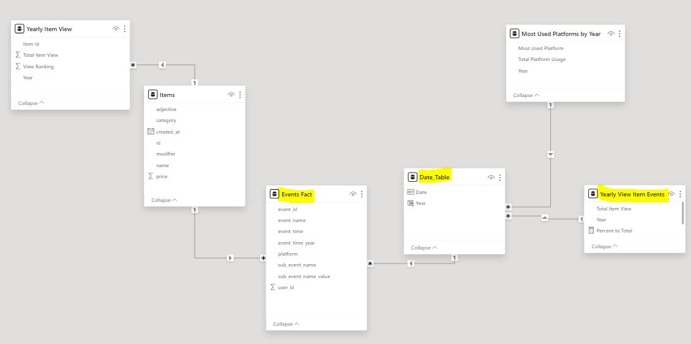
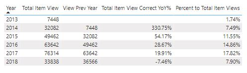
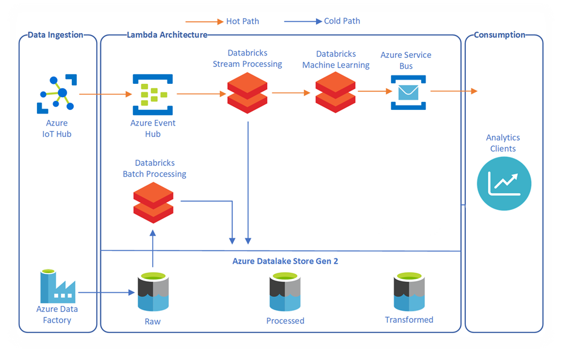

# Data Engineering Task Solution
## Motivation
This repo created to be used as a codespace for a Data Engineering task.
There are ipynb notebooks and xlsx files on main branch. Those files are creating and ELT process to create Views on a data mart created from CSV source files located on S3 bucket.
Databricks used as data platform with PYSPARK code holding notebooks does the related activities.

## Contents of Repo
**dat** : A file that holds dat python module files (Data Profiling/Analysis Module) that is a module compiled by myself and has many methods to apply profiling/analysis activities for structured/semi-structured data sources located on different platforms. Can be imported to ipynb notebooks with import dat command. Detailed information can be found on link (https://github.com/Giray18/data_analysis_tool)

Below is screenshot of null value profiling of dat module output.
 

**analysis_dataset_event.csv_2024-05-06.xlsx** : Output of data_profiling notebook which can be found on (https://github.com/Giray18/de_task/blob/main/data_profiling_notebook.ipynb) this notebook connects to S3 bucket sources and automatically creates an output xlsx file that holds profile of data source file.

**analysis_dataset_item.csv_2024-05-06.xlsx** : Same with above explanation but this time profiling made for item.csv file located on source location.

**bronze_layer_pipeline.ipynb** : A notebook that holds pyspark code that is being used on raw data ingestion of bronze layer.

**data_profiling_notebook.ipynb** : Holds python code that is being used on data profiling activity of source files on S3 bucket.

**gold_layer_pipeline.ipynb** : A notebook that holds pyspark code that is being used on aggregation of gold layer.

**helper_notebook.ipynb** : A notebook that holds python/pyspark functions and data structures that is being used on ELT transformation notebooks (bronze_layer, silver_layer and gold_layer)

**silver_layer_pipeline.ipynb** : A notebook that holds pyspark code that is being used on data transformations of silver layer.

**starter_notebook.ipynb** : A notebook that holds pyspark code that is being used on trigger activities of transformation notebooks (bronze,silver and gold).
Below there is a screenshot of notebook workflows after starter_notebook initiated.
 

**misc. JPG files** : Files holds screenshots used on README. (profiling_output.JPG,notebook_runs.JPG,task_flow_diagram.jpg,catalog_screenshot.JPG)

## Flow Diagram
Steps related to solution can be found on below flow diagram

 

## Top Item Datamart Views
Requested views extract can be found on below files

Total number of item views in a particular year : Item_view_year.csv  
Rank of an item based on number of views in a particular year : Item_rank_year.csv  
The most used platform in particular year : Most_used_platform.csv  

## Storage Layer
Below screenshot of final status of storage layer. It can be seen that tables created on external storage (databricks_xis672e and hive metastore (gold_layer)). Addition to requested views, items and events tables are also saved into both layers. Because on BI tools, created views can have one-many connection with fact table (events) and date tables (Bi tool created) to craft time intelligence calculations. In case further analytical calculations needed on Views like (Year over year, Percent to total etc). A short demo shown on below screenshots.

 

PBI model created to demonstrate above explanation (Date table created on PBI by AUTOCALENDAR DAX)

 

A table visual demonstrates above explanation which uses date table (for Time intelligence DAX), fact and views together

 

## Theoretical Assignment

Explain in couple of paragraphs the difference between Data Lakehouse and Data Warehouse

Data lakehouse, is the storage layer that adds relational database semantics to data lake processing, by this feature without creating a data warehouse on top of data lake, querying and data modification is available by Data Lakehouse, you can store data in tables that support CRUD (create, read, update, and delete) as we do in relational database operations as well as ACID compliance. Less resource means less admin headache, less storage and processing means less cost on cloud platforms

One other advantage of Data lakehouse compliant systems are being able to operate on delta tables. Since the structure of Delta keep records on changes to be done on tables, we may have capability to versioning on write and time travel through versions by time or version number.

Usually, on delta lakehouse architecture 3 tier structure being used to host data in transformation. An Ingestion layer, A cleaned (normalized data layer), An aggregated data layer. Processing done with distributed compute systems like spark or synaypse analytics dedicated sql server.

An example, architecture would an Azure based Lambda architecture, We may use delta lake storage as lakehouse and manage process with both badge ingests and stream upserts on top of it. We establish all 3 layers on delta lake. Needed sources defined on visual on right side. (A Blob storage container – Databricks – Kafka, Messaging services or Azure Event Hub – Azure Stream Analytics)

 
