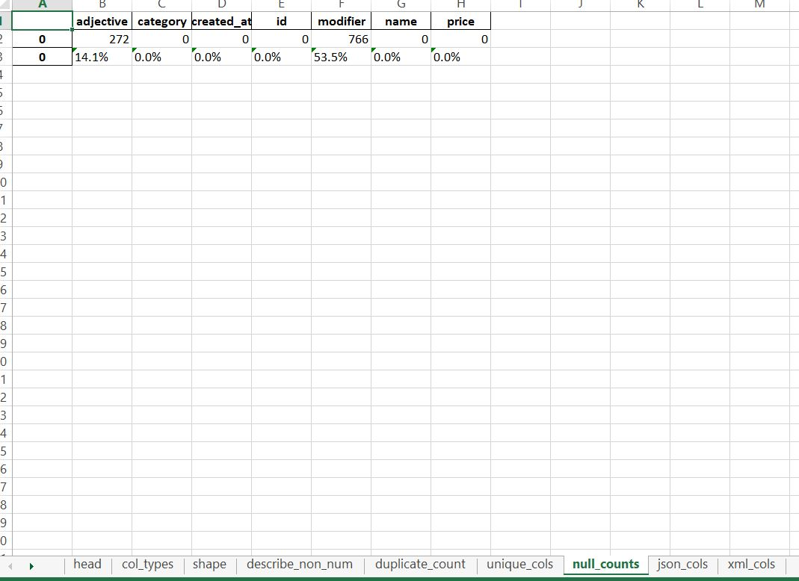
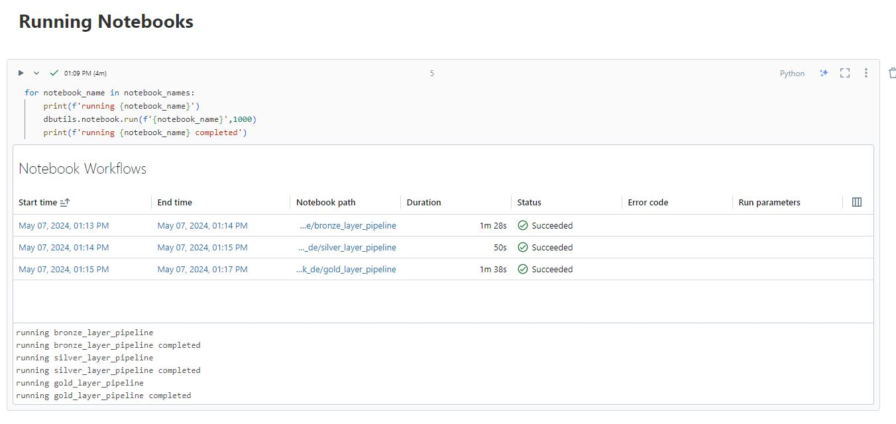
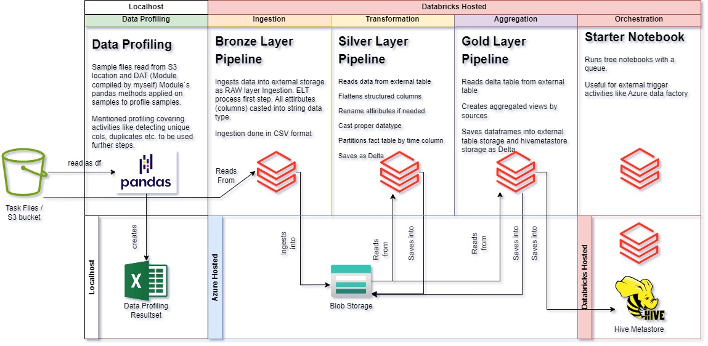
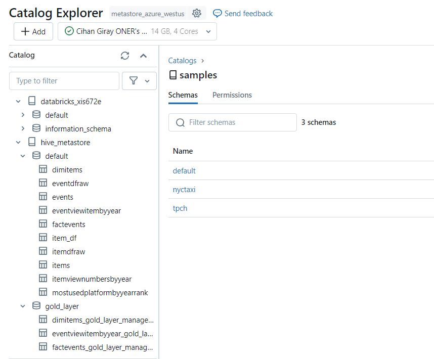

# Data Engineering Task Solution
## Motivation
This repo created to be used as a codespace for a Data Engineering task.
There are ipynb notebooks and xlsx files on main branch. Those files are creating and ELT process to create Views on a data mart created from CSV source files located on S3 bucket.
Databricks used as data platform with PYSPARK code holding notebooks does the related activities.

## Contents of Repo
**dat** : A file that holds dat python module files (Data Profiling/Analysis Module) that is a module compiled by myself and has many methods to apply profiling/analysis activities for structured/semi-structured data sources located on different platforms. Can be imported to ipynb notebooks with import dat command. Detailed information can be found on link (https://github.com/Giray18/data_analysis_tool)

Below is screenshot of null value profiling of dat module output.
 

**analysis_dataset_event.csv_2024-05-06.xlsx** : Output of data_profiling notebook which can be found on (https://github.com/Giray18/de_task/blob/main/data_profiling_notebook.ipynb) this notebook connects to S3 bucket sources and automatically creates an output xlsx file that holds profile of data source file.

**analysis_dataset_item.csv_2024-05-06.xlsx** : Same with above explanation but this time profiling made for item.csv file located on source location.

**bronze_layer_pipeline.ipynb** : A notebook that holds pyspark code that is being used on raw data ingestion of bronze layer.

**data_profiling_notebook.ipynb** : Holds python code that is being used on data profiling activity of source files on S3 bucket.

**gold_layer_pipeline.ipynb** : A notebook that holds pyspark code that is being used on aggregation of gold layer.

**helper_notebook.ipynb** : A notebook that holds python/pyspark functions and data structures that is being used on ELT transformation notebooks (bronze_layer, silver_layer and gold_layer)

**silver_layer_pipeline.ipynb** : A notebook that holds pyspark code that is being used on data transformations of silver layer.

**starter_notebook.ipynb** : A notebook that holds pyspark code that is being used on trigger activities of transformation notebooks (bronze,silver and gold).
Below there is a screenshot of notebook workflows after starter_notebook initiated.
 

**misc. JPG files** : Files holds screenshots used on README. (profiling_output.JPG,notebook_runs.JPG,task_flow_diagram.jpg,catalog_screenshot.JPG)

## Flow Diagram
Steps related to solution can be found on below flow diagram

 

## Top Item Datamart Views
Below are screenshots of aggregated views required by task

## Storage Layer
Below screenshot of final status of storage layer. It can be seen that tables created on external storage (databricks_xis672e and hive metastore (gold_layer)).

 

 
